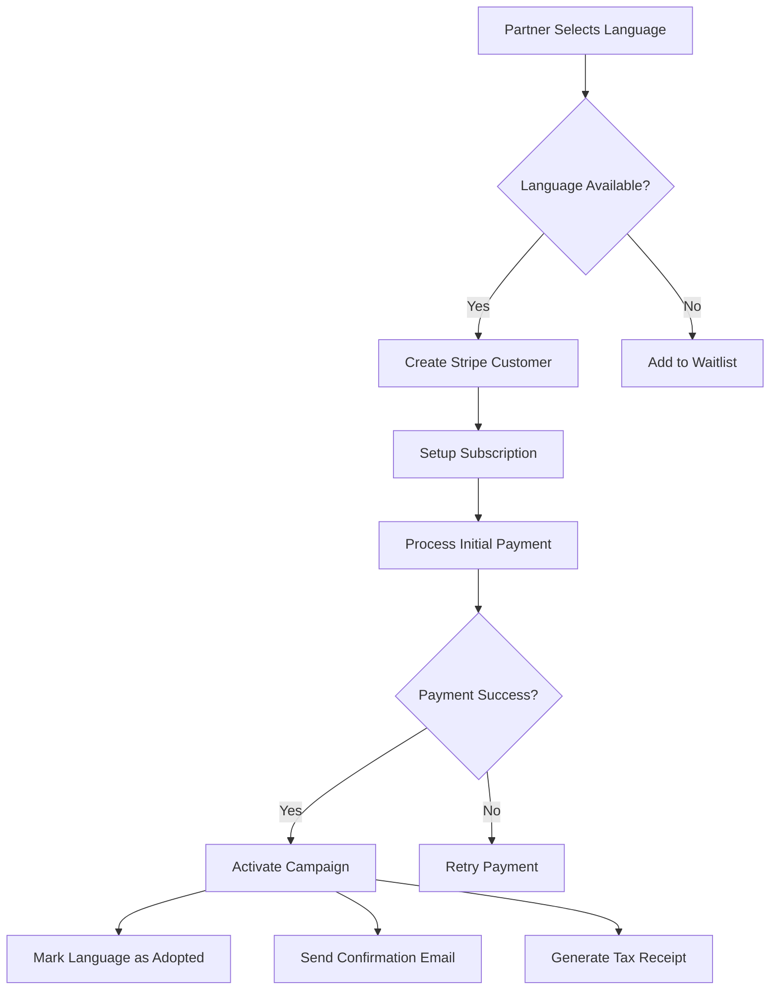
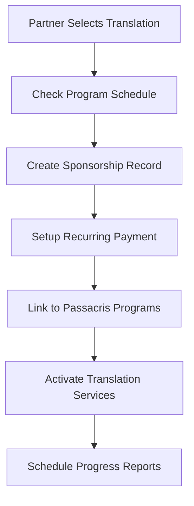
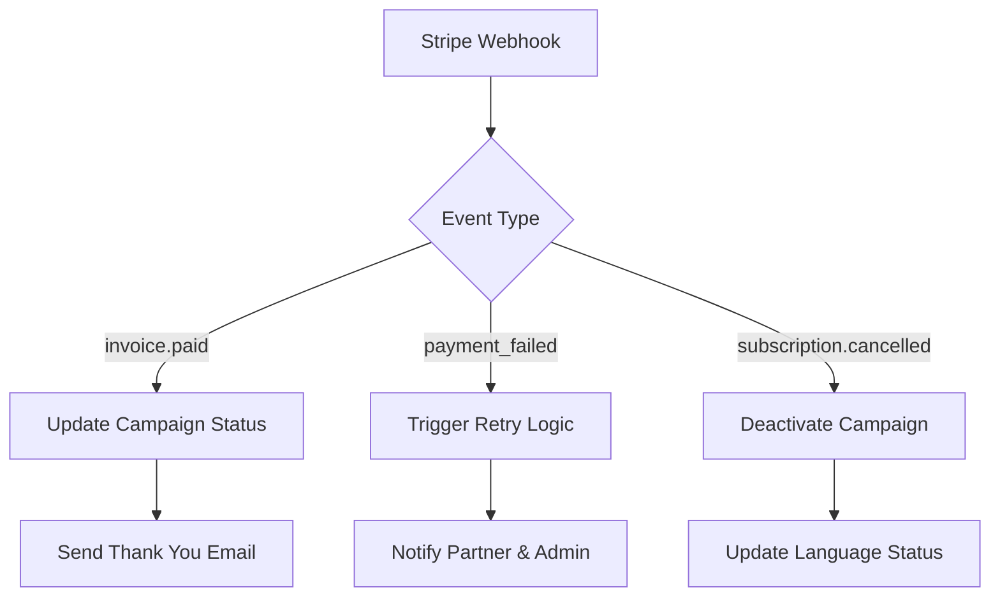

# Loveworld Europe Campaign Portal - Design Specification

## Overview

The Loveworld Europe Campaign Portal is a modern web application designed to facilitate two primary fundraising campaigns: "Adopt a Language" and "Sponsor Translation". This platform enables global partners to financially support Loveworld Europe's mission to broadcast Christian content across 60 languages in Europe, with a current reach of 30 language channels and a goal to reach 750 million souls.

### Key Objectives
- Enable partners to adopt languages at £150/month recurring payments
- Facilitate translation sponsorship at £150/month for live Passacris program translations
- Provide intuitive, eye-catching interface to encourage donations
- Offer comprehensive admin dashboard for campaign management
- Integrate secure payment processing via Stripe

## Technology Stack & Dependencies

### Frontend Framework
- **React 18** with TypeScript for type safety and modern development
- **Next.js 14** for server-side rendering, SEO optimization, and performance
- **Tailwind CSS** for responsive, modern styling
- **Framer Motion** for smooth animations and micro-interactions

### UI Components & Design
- **Headless UI** for accessible component primitives
- **React Hook Form** for form validation and management
- **Zod** for schema validation
- **Lucide React** for consistent iconography

### Backend & Database
- **Node.js** with Express.js for API development
- **PostgreSQL** for robust data persistence
- **Prisma ORM** for type-safe database operations
- **Redis** for session management and caching

### Payment & Security
- **Stripe API** for payment processing and subscription management
- **JWT** for authentication and authorization
- **bcrypt** for password hashing
- **HTTPS/SSL** for secure data transmission

### Monitoring & Analytics
- **Google Analytics 4** for user behavior tracking
- **Sentry** for error monitoring and performance tracking

## Component Architecture

### Public-Facing Components

#### Landing Page (`/`)
```
LandingPage
├── HeroSection
│   ├── VideoBackground (Passacris clips)
│   ├── MissionStatement
│   └── CampaignCTAButtons
├── CampaignOverview
│   ├── AdoptLanguageCard
│   └── SponsorTranslationCard
├── ImpactMetrics
│   ├── LanguageCounter (30/60)
│   ├── CountriesReached (50)
│   └── PotentialAudience (750M)
└── TestimonialsSection
```

#### Language Selection (`/adopt-language`)
```
LanguageAdoptionPage
├── LanguageGrid
│   ├── LanguageCard[]
│   │   ├── LanguageFlag
│   │   ├── LanguageName
│   │   ├── CountryInfo
│   │   ├── SpeakerCount
│   │   └── AdoptionStatus
│   └── FilterControls
│       ├── RegionFilter
│       ├── StatusFilter (Available/Adopted)
│       └── SearchInput
├── SelectionSummary
└── ProceedToPayment
```

#### Translation Sponsorship (`/sponsor-translation`)
```
TranslationSponsorPage
├── ProgramOverview
│   ├── PassacrisDescription
│   ├── TranslationImpact
│   └── LiveBroadcastSchedule
├── LanguageSelection
│   ├── PriorityLanguages
│   └── AllLanguagesGrid
└── SponsorshipOptions
    ├── MonthlySponsorship (£150)
    ├── QuarterlySponsorship
    └── AnnualSponsorship
```

#### Checkout Flow (`/checkout`)
```
CheckoutPage
├── OrderSummary
│   ├── CampaignType
│   ├── SelectedLanguage(s)
│   ├── PaymentAmount
│   └── RecurrenceSettings
├── DonorInformation
│   ├── PersonalDetails
│   ├── ContactInformation
│   └── OrganizationDetails (optional)
├── PaymentSection
│   ├── StripeElements
│   ├── PaymentMethodSelector
│   └── BillingAddress
└── ConfirmationStep
```

### Administrative Components

#### Admin Dashboard (`/admin`)
```
AdminDashboard
├── DashboardHeader
│   ├── UserProfile
│   ├── NotificationCenter
│   └── QuickActions
├── MetricsOverview
│   ├── TotalRevenue
│   ├── ActiveSubscriptions
│   ├── LanguageAdoptions
│   └── TranslationSponsors
├── CampaignManagement
│   ├── LanguageStatus
│   ├── SponsorshipTracking
│   └── PaymentHealth
└── PartnerManagement
    ├── PartnerDirectory
    ├── CommunicationTools
    └── ExportFeatures
```

## Data Models & Database Schema

### User/Partner Model
```typescript
interface Partner {
  id: string;
  email: string;
  firstName: string;
  lastName: string;
  phoneNumber?: string;
  organization?: string;
  country: string;
  preferredLanguage: string;
  createdAt: Date;
  updatedAt: Date;
  stripeCustomerId: string;
  isActive: boolean;
}
```

### Language Model
```typescript
interface Language {
  id: string;
  name: string;
  nativeName: string;
  iso639Code: string;
  region: string;
  country: string[];
  speakerCount: number;
  flagUrl: string;
  isActive: boolean;
  adoptionStatus: 'AVAILABLE' | 'ADOPTED' | 'PENDING';
  translationNeedsSponsorship: boolean;
  priority: number;
}
```

### Campaign Model
```typescript
interface Campaign {
  id: string;
  type: 'ADOPT_LANGUAGE' | 'SPONSOR_TRANSLATION';
  partnerId: string;
  languageId: string;
  monthlyAmount: number;
  currency: string;
  startDate: Date;
  endDate?: Date;
  status: 'ACTIVE' | 'PAUSED' | 'CANCELLED';
  stripeSubscriptionId: string;
  nextBillingDate: Date;
}
```

### Payment Model
```typescript
interface Payment {
  id: string;
  campaignId: string;
  partnerId: string;
  amount: number;
  currency: string;
  stripePaymentIntentId: string;
  status: 'PENDING' | 'SUCCEEDED' | 'FAILED';
  paymentDate: Date;
  failureReason?: string;
}
```

## API Endpoints Reference

### Public API Endpoints

#### Language Management
```
GET /api/languages
- Returns available languages with adoption status
- Query params: region?, status?, search?
- Response: Language[]

GET /api/languages/:id
- Returns detailed language information
- Response: Language with adoption metrics

POST /api/languages/:id/check-availability
- Checks if language is available for adoption
- Response: { available: boolean, waitlist?: boolean }
```

#### Campaign Creation
```
POST /api/campaigns/adopt-language
- Creates language adoption campaign
- Body: { languageId, partnerInfo, paymentMethod }
- Response: { campaignId, stripeSubscriptionId }

POST /api/campaigns/sponsor-translation
- Creates translation sponsorship
- Body: { languageId, partnerInfo, paymentMethod }
- Response: { campaignId, stripeSubscriptionId }
```

#### Payment Processing
```
POST /api/payments/create-intent
- Creates Stripe payment intent
- Body: { amount, currency, campaignType }
- Response: { clientSecret, paymentIntentId }

POST /api/payments/confirm
- Confirms payment and activates campaign
- Body: { paymentIntentId, campaignId }
- Response: { success, subscriptionStatus }
```

### Admin API Endpoints

#### Analytics & Reporting
```
GET /api/admin/analytics/overview
- Returns dashboard metrics
- Query params: dateRange?, campaignType?
- Response: AnalyticsSummary

GET /api/admin/analytics/revenue
- Returns revenue analytics
- Query params: groupBy?, period?
- Response: RevenueData[]

GET /api/admin/exports/partners
- Exports partner data as CSV/Excel
- Query params: format?, filters?
- Response: File download
```

#### Partner Management
```
GET /api/admin/partners
- Returns paginated partner list
- Query params: page?, limit?, search?, status?
- Response: PaginatedPartners

GET /api/admin/partners/:id
- Returns detailed partner information
- Response: Partner with campaigns and payments

PUT /api/admin/partners/:id
- Updates partner information
- Body: Partial<Partner>
- Response: Updated Partner

POST /api/admin/partners/:id/communications
- Logs communication with partner
- Body: { type, content, followUpDate? }
- Response: Communication record
```

#### Campaign Management
```
GET /api/admin/campaigns
- Returns all campaigns with filtering
- Query params: status?, type?, partnerId?, languageId?
- Response: Campaign[]

PUT /api/admin/campaigns/:id/status
- Updates campaign status
- Body: { status, reason? }
- Response: Updated Campaign

GET /api/admin/campaigns/:id/payments
- Returns payment history for campaign
- Response: Payment[]
```

### Authentication Requirements

All admin endpoints require JWT authentication with role-based access:
- **Super Admin**: Full access to all endpoints
- **Campaign Manager**: Read/write access to campaigns and partners
- **Finance**: Read access to payments and reports
- **Viewer**: Read-only access to dashboard metrics

## Business Logic Layer Architecture

### Campaign Management Service

#### Language Adoption Flow


#### Translation Sponsorship Flow


### Payment Processing Service

#### Subscription Management
- **Creation**: Initialize Stripe subscription with trial period
- **Updates**: Handle plan changes and proration
- **Cancellation**: Process cancellations with retention workflows
- **Failed Payments**: Implement dunning management with 3-attempt retry
- **Tax Handling**: Calculate VAT for EU partners, generate compliant receipts

#### Webhook Processing


### Communication Service

#### Automated Email Workflows
- **Welcome Series**: 3-email sequence for new partners
- **Monthly Updates**: Progress reports on supported languages/translations
- **Payment Reminders**: Before failed payment attempts
- **Impact Reports**: Quarterly stories of transformation
- **Renewal Notifications**: 30 days before subscription end

#### Admin Communication Tools
- **Partner Outreach**: CRM-style communication logging
- **Bulk Messaging**: Segmented email campaigns
- **Follow-up Scheduling**: Automated reminder system

## User Interface Design Specifications

### Design System

#### Color Palette
- **Primary**: Deep Blue (#1B365D) - Trust and stability
- **Secondary**: Gold (#D4AF37) - Prosperity and divine connection
- **Accent**: Crimson (#DC143C) - Passion and urgency
- **Success**: Forest Green (#228B22) - Growth and life
- **Background**: Warm White (#FAFAFA)
- **Text**: Charcoal (#333333)

#### Typography Scale
- **Headlines**: Playfair Display (serif) - Elegant and authoritative
- **Body Text**: Inter (sans-serif) - Highly legible and modern
- **UI Elements**: Inter Medium - Consistent interface text

#### Component Styling

##### Language Cards
```css
.language-card {
  @apply bg-white rounded-xl shadow-lg hover:shadow-xl transition-all duration-300;
  @apply border border-gray-100 hover:border-primary-200;
  @apply p-6 cursor-pointer transform hover:-translate-y-1;
}

.language-flag {
  @apply w-12 h-8 rounded-md object-cover shadow-sm;
}

.adoption-badge {
  @apply px-3 py-1 rounded-full text-sm font-medium;
  /* Available: bg-green-100 text-green-800 */
  /* Adopted: bg-primary-100 text-primary-800 */
}
```

##### Campaign Cards
```css
.campaign-card {
  @apply bg-gradient-to-br from-primary-50 to-primary-100;
  @apply rounded-2xl p-8 shadow-lg hover:shadow-xl;
  @apply border border-primary-200 transition-all duration-300;
}

.cta-button {
  @apply bg-accent text-white px-8 py-3 rounded-lg;
  @apply font-semibold text-lg hover:bg-accent-dark;
  @apply transform hover:scale-105 transition-all duration-200;
  @apply shadow-lg hover:shadow-xl;
}
```

### Responsive Design Strategy

#### Breakpoint System
- **Mobile**: 320px - 767px (Stack vertically, simplified navigation)
- **Tablet**: 768px - 1023px (2-column grid, collapsible sidebar)
- **Desktop**: 1024px+ (3-column grid, full feature set)

#### Mobile-First Approach
- Progressive enhancement from mobile base design
- Touch-friendly interface elements (44px minimum touch targets)
- Simplified navigation with hamburger menu
- Optimized checkout flow for mobile conversion

### Accessibility Compliance

#### WCAG 2.1 AA Standards
- **Keyboard Navigation**: Full tab sequence for all interactive elements
- **Screen Reader Support**: Proper ARIA labels and roles
- **Color Contrast**: 4.5:1 minimum ratio for text
- **Focus Indicators**: Visible focus states for all controls
- **Alt Text**: Descriptive text for flags and images

## Routing & Navigation

### Public Routes
```
/ (Landing Page)
├── /adopt-language (Language Selection)
├── /sponsor-translation (Translation Programs)
├── /checkout (Payment Flow)
├── /confirmation (Success Page)
├── /about (Mission & Impact)
├── /partners (Partner Stories)
└── /contact (Support & Inquiries)
```

### Admin Routes (Protected)
```
/admin (Dashboard Overview)
├── /admin/campaigns (Campaign Management)
├── /admin/partners (Partner Directory)
├── /admin/languages (Language Status)
├── /admin/payments (Financial Overview)
├── /admin/reports (Analytics & Exports)
├── /admin/communications (Partner Outreach)
└── /admin/settings (System Configuration)
```

### Navigation Components

#### Public Header
```jsx
<Header>
  <Logo />
  <Navigation>
    <Link href="/adopt-language">Adopt a Language</Link>
    <Link href="/sponsor-translation">Sponsor Translation</Link>
    <Link href="/about">About</Link>
    <Link href="/contact">Contact</Link>
  </Navigation>
  <CTAButton>Start Supporting</CTAButton>
</Header>
```

#### Admin Sidebar
```jsx
<AdminSidebar>
  <DashboardLink />
  <CampaignSection>
    <CampaignsLink />
    <LanguagesLink />
  </CampaignSection>
  <PartnerSection>
    <PartnersLink />
    <CommunicationsLink />
  </PartnerSection>
  <FinanceSection>
    <PaymentsLink />
    <ReportsLink />
  </FinanceSection>
  <SettingsLink />
</AdminSidebar>
```

## State Management Architecture

### Global State (Redux Toolkit)

#### Campaign State
```typescript
interface CampaignState {
  selectedLanguages: Language[];
  campaignType: 'ADOPT_LANGUAGE' | 'SPONSOR_TRANSLATION' | null;
  checkoutStep: 'SELECTION' | 'DETAILS' | 'PAYMENT' | 'CONFIRMATION';
  partnerInfo: Partial<Partner>;
  paymentIntent: string | null;
  loading: boolean;
  error: string | null;
}
```

#### Admin State
```typescript
interface AdminState {
  user: AdminUser | null;
  partners: {
    list: Partner[];
    total: number;
    loading: boolean;
    filters: PartnerFilters;
  };
  campaigns: {
    list: Campaign[];
    total: number;
    loading: boolean;
    filters: CampaignFilters;
  };
  analytics: DashboardMetrics;
}
```

### Local State Management

#### Form State (React Hook Form)
- Checkout form validation and submission
- Partner information capture
- Admin form handling with real-time validation

#### Component State (useState/useReducer)
- Modal visibility and content
- Loading states for individual operations
- Temporary UI state (expanded cards, selected filters)

## API Integration Layer

### HTTP Client Configuration
```typescript
// Base API client with interceptors
const apiClient = axios.create({
  baseURL: process.env.NEXT_PUBLIC_API_URL,
  timeout: 10000,
});

// Request interceptor for authentication
apiClient.interceptors.request.use((config) => {
  const token = getAuthToken();
  if (token) {
    config.headers.Authorization = `Bearer ${token}`;
  }
  return config;
});

// Response interceptor for error handling
apiClient.interceptors.response.use(
  (response) => response,
  (error) => {
    if (error.response?.status === 401) {
      redirectToLogin();
    }
    return Promise.reject(error);
  }
);
```

### Service Layer Architecture
```typescript
// Language Service
export const languageService = {
  getLanguages: (filters?: LanguageFilters) => 
    apiClient.get('/api/languages', { params: filters }),
  
  getLanguageDetails: (id: string) => 
    apiClient.get(`/api/languages/${id}`),
  
  checkAvailability: (id: string) => 
    apiClient.post(`/api/languages/${id}/check-availability`),
};

// Campaign Service
export const campaignService = {
  createAdoption: (data: AdoptionRequest) => 
    apiClient.post('/api/campaigns/adopt-language', data),
  
  createSponsorship: (data: SponsorshipRequest) => 
    apiClient.post('/api/campaigns/sponsor-translation', data),
  
  getCampaigns: (filters?: CampaignFilters) => 
    apiClient.get('/api/campaigns', { params: filters }),
};
```

### Error Handling Strategy
- **Network Errors**: Retry mechanism with exponential backoff
- **Validation Errors**: Form-level error display with field highlighting
- **Server Errors**: User-friendly messages with error reporting
- **Payment Errors**: Stripe-specific error handling with retry options

## Testing Strategy

### Unit Testing (Jest + React Testing Library)

#### Component Testing
```typescript
// Language Card Component Test
describe('LanguageCard', () => {
  it('should display language information correctly', () => {
    const mockLanguage = {
      id: '1',
      name: 'Spanish',
      nativeName: 'Español',
      country: ['Spain'],
      speakerCount: 500000000,
      adoptionStatus: 'AVAILABLE'
    };
    
    render(<LanguageCard language={mockLanguage} />);
    
    expect(screen.getByText('Spanish')).toBeInTheDocument();
    expect(screen.getByText('Español')).toBeInTheDocument();
    expect(screen.getByText('Available')).toBeInTheDocument();
  });
  
  it('should handle adoption click', () => {
    const mockOnAdopt = jest.fn();
    render(<LanguageCard language={mockLanguage} onAdopt={mockOnAdopt} />);
    
    fireEvent.click(screen.getByText('Adopt This Language'));
    expect(mockOnAdopt).toHaveBeenCalledWith(mockLanguage.id);
  });
});
```

#### Service Testing
```typescript
// Campaign Service Test
describe('campaignService', () => {
  beforeEach(() => {
    jest.clearAllMocks();
  });
  
  it('should create language adoption successfully', async () => {
    const mockResponse = { campaignId: '123', status: 'active' };
    mockApiClient.post.mockResolvedValue({ data: mockResponse });
    
    const result = await campaignService.createAdoption(mockAdoptionData);
    
    expect(mockApiClient.post).toHaveBeenCalledWith(
      '/api/campaigns/adopt-language',
      mockAdoptionData
    );
    expect(result.data).toEqual(mockResponse);
  });
});
```

### Integration Testing (Cypress)

#### Critical User Flows
```typescript
// Language Adoption Flow
describe('Language Adoption Flow', () => {
  it('should complete full adoption process', () => {
    cy.visit('/adopt-language');
    
    // Select language
    cy.get('[data-testid="language-spanish"]').click();
    cy.get('[data-testid="adopt-button"]').click();
    
    // Fill partner information
    cy.get('[data-testid="first-name"]').type('John');
    cy.get('[data-testid="last-name"]').type('Doe');
    cy.get('[data-testid="email"]').type('john@example.com');
    
    // Payment process (using Stripe test cards)
    cy.get('[data-testid="card-element"]').type('4242424242424242');
    cy.get('[data-testid="expiry"]').type('12/25');
    cy.get('[data-testid="cvc"]').type('123');
    
    cy.get('[data-testid="complete-adoption"]').click();
    
    // Verify success
    cy.url().should('include', '/confirmation');
    cy.get('[data-testid="success-message"]').should('be.visible');
  });
});
```

#### Admin Dashboard Testing
```typescript
describe('Admin Dashboard', () => {
  beforeEach(() => {
    cy.login('admin@loveworld.com', 'password123');
  });
  
  it('should display campaign metrics correctly', () => {
    cy.visit('/admin');
    
    cy.get('[data-testid="total-revenue"]').should('contain', '£');
    cy.get('[data-testid="active-campaigns"]').should('contain', 'Active');
    cy.get('[data-testid="partner-count"]').should('be.visible');
  });
  
  it('should export partner data', () => {
    cy.visit('/admin/partners');
    
    cy.get('[data-testid="export-button"]').click();
    cy.get('[data-testid="export-csv"]').click();
    
    // Verify download
    cy.readFile('cypress/downloads/partners.csv').should('exist');
  });
});
```

### Performance Testing

#### Lighthouse CI Integration
- **Performance Budget**: 90+ score on mobile and desktop
- **Accessibility**: 100 score compliance
- **SEO**: 95+ score for public pages
- **Best Practices**: 100 score for security and standards

#### Load Testing (Artillery.js)
```yaml
# artillery-config.yml
config:
  target: 'https://campaigns.loveworld.com'
  phases:
    - duration: 60
      arrivalRate: 10
    - duration: 120
      arrivalRate: 20
      
scenarios:
  - name: "Language Adoption Flow"
    flow:
      - get:
          url: "/adopt-language"
      - think: 3
      - post:
          url: "/api/campaigns/adopt-language"
          json:
            languageId: "spanish"
            partnerInfo: "{{ partner }}"
```